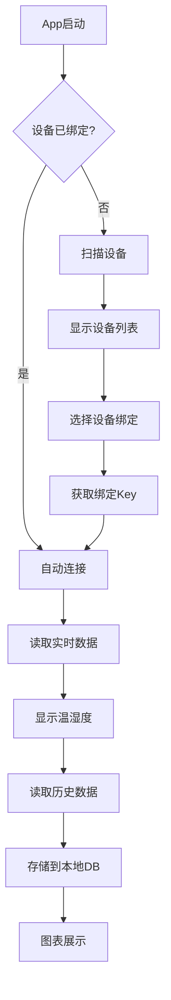
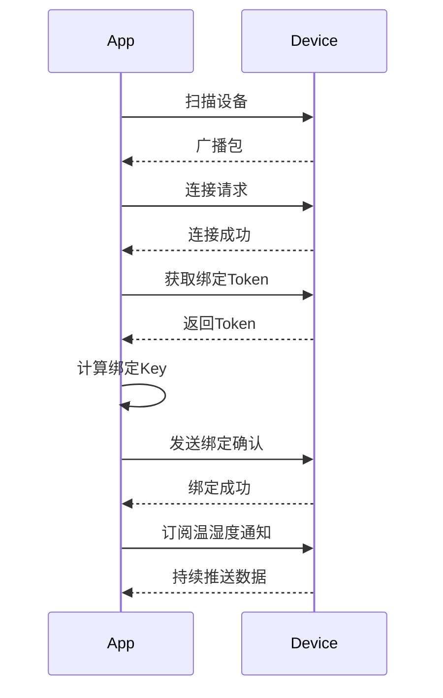

# 小米温湿度2 安卓App 开发计划

## 1. 项目概述

### 1.1 项目目标
开发一个可以连接小米温湿度计2（LYWSD03MMC）的安卓手机应用，支持：
- 蓝牙BLE连接设备
- 读取实时温湿度数据
- 读取设备存储的历史数据
- 通过GitHub Actions自动编译

### 1.2 目标设备
- **设备型号**: 小米温湿度计2 (LYWSD03MMC)
- **通信方式**: Bluetooth Low Energy (BLE) 4.2
- **数据存储**: 设备内部可存储约100天历史数据

---

## 2. 技术架构

### 2.1 推荐技术栈

```
┌─────────────────────────────────────────────────────────────┐
│                    Android Application                       │
├─────────────────────────────────────────────────────────────┤
│  UI Layer          │  Jetpack Compose + Material Design 3   │
├─────────────────────────────────────────────────────────────┤
│  ViewModel         │  Android ViewModel + StateFlow         │
├─────────────────────────────────────────────────────────────┤
│  Use Cases         │  Domain Layer - Clean Architecture     │
├─────────────────────────────────────────────────────────────┤
│  Repository        │  Data Repository Pattern               │
├─────────────────────────────────────────────────────────────┤
│  Data Sources      │  BLE Service  │  Room DB  │  Preferences│
└─────────────────────────────────────────────────────────────┘
```

### 2.2 核心技术选型

| 组件 | 技术 | 说明 |
|------|------|------|
| 语言 | Kotlin | 现代Android开发首选 |
| 最低SDK | Android 6.0 (API 23) | 覆盖99%设备 |
| UI框架 | Jetpack Compose | 现代声明式UI |
| BLE库 | Android BLE | 原生BluetoothGatt |
| 数据库 | Room | SQLite封装 |
| 依赖注入 | Hilt | Google推荐DI框架 |
| 架构 | MVVM + Clean Architecture | 可测试、可维护 |
| 图表 | MPAndroidChart 或 Vico | 数据可视化 |

### 2.3 项目结构

```
app/
├── build.gradle.kts
├── src/
│   ├── main/
│   │   ├── java/com/example/thermometer/
│   │   │   ├── di/                    # 依赖注入模块
│   │   │   ├── domain/                # 业务逻辑层
│   │   │   │   ├── model/             # 领域模型
│   │   │   │   ├── repository/        # 仓库接口
│   │   │   │   └── usecase/           # 用例
│   │   │   ├── data/                  # 数据层
│   │   │   │   ├── ble/               # BLE通信
│   │   │   │   ├── db/                # 本地数据库
│   │   │   │   └── repository/        # 仓库实现
│   │   │   ├── ui/                    # UI层
│   │   │   │   ├── theme/             # 主题
│   │   │   │   ├── screens/           # 各页面
│   │   │   │   └── components/        # 通用组件
│   │   │   └── MainActivity.kt
│   │   ├── res/
│   │   └── AndroidManifest.xml
│   └── test/                          # 单元测试
│   └── androidTest/                   # 仪器测试
└── proguard-rules.pro
```

---

## 3. 功能模块设计

### 3.1 核心功能



### 3.2 功能列表

#### Phase 1 - 核心功能 (MVP)
- [ ] BLE设备扫描与绑定
- [ ] 设备绑定Key管理
- [ ] 实时温湿度读取
- [ ] 历史数据读取（从设备）
- [ ] 数据本地存储
- [ ] 基础UI界面

#### Phase 2 - 增强功能
- [ ] 历史数据图表展示
- [ ] 数据导出（CSV/JSON）
- [ ] 多设备管理
- [ ] 温湿度报警设置
- [ ] 后台自动同步

#### Phase 3 - 高级功能
- [ ] 桌面小部件
- [ ] 深色模式
- [ ] 云端同步（可选）
- [ ] 多语言支持

---

## 4. BLE通信协议

### 4.1 小米温湿度2 BLE服务

| UUID | 描述 |
|------|------|
| 0x181A | 环境感知服务 |
| 0x2A6E | 温度特征 |
| 0x2A6F | 湿度特征 |
| 0x2902 | CCC描述符（通知） |

### 4.2 自定义服务（用于历史数据）

| UUID | 描述 |
|------|------|
| 0x1810 | 设备信息服务 |
| 0x2A1F | 历史数据时间戳 |
| 0x2A20 | 历史数据记录 |

### 4.3 数据绑定流程



---

## 5. GitHub Actions CI/CD

### 5.1 工作流程

```yaml
name: Android CI/CD

on:
  push:
    branches: [ main, develop ]
  pull_request:
    branches: [ main ]
  workflow_dispatch:

jobs:
  build:
    runs-on: ubuntu-latest
    steps:
      - uses: actions/checkout@v4
      
      - name: Set up JDK 17
        uses: actions/setup-java@v4
        with:
          java-version: '17'
          distribution: 'temurin'
          
      - name: Setup Gradle
        uses: gradle/actions/setup-gradle@v3
        
      - name: Build Debug APK
        run: ./gradlew assembleDebug
        
      - name: Build Release APK
        run: ./gradlew assembleRelease
        
      - name: Upload Debug APK
        uses: actions/upload-artifact@v4
        with:
          name: app-debug
          path: app/build/outputs/apk/debug/
          
      - name: Upload Release APK
        uses: actions/upload-artifact@v4
        with:
          name: app-release
          path: app/build/outputs/apk/release/
```

### 5.2 签名配置

Release版本需要配置签名：
- 使用GitHub Secrets存储密钥库
- 支持自动签名发布

---

## 6. 开发里程碑

### Milestone 1: 项目初始化
- [ ] 创建Android项目
- [ ] 配置Gradle依赖
- [ ] 设置GitHub Actions
- [ ] 实现基础UI框架

### Milestone 2: BLE通信
- [ ] 实现BLE扫描
- [ ] 实现设备连接
- [ ] 实现绑定流程
- [ ] 读取实时数据

### Milestone 3: 数据管理
- [ ] 实现历史数据读取
- [ ] Room数据库集成
- [ ] 数据图表展示

### Milestone 4: 发布准备
- [ ] UI优化
- [ ] 测试覆盖
- [ ] 文档完善
- [ ] 首次发布

---

## 7. 参考资源

### 开源项目参考
1. [MiTemp2MQTT](https://github.com/iskalchev/MiTemp2MQTT) - BLE通信协议参考
2. [Xiaomi-BLE-Token](https://github.com/iskalchev/Xiaomi-BLE-Token) - 绑定算法
3. [PVVX Firmware](https://github.com/pvvx/ZigbeeTLc) - 自定义固件协议

### 技术文档
- [Android BLE Guide](https://developer.android.com/guide/topics/connectivity/bluetooth-le)
- [Jetpack Compose](https://developer.android.com/jetpack/compose)
- [Room Persistence](https://developer.android.com/training/data-storage/room)

---

## 8. 下一步行动

1. 确认技术选型是否满足需求
2. 创建Android项目骨架
3. 实现BLE扫描和连接功能
4. 逐步完成各功能模块

---

*文档版本: 1.0*
*创建日期: 2026-03-31*
